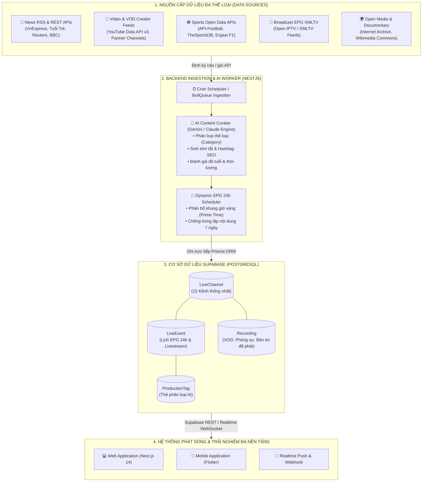
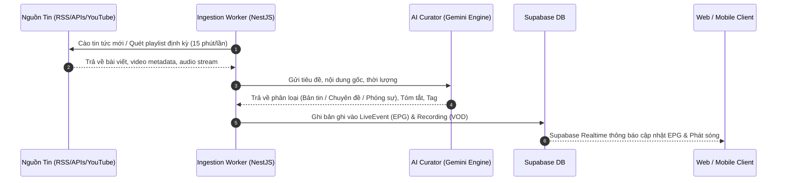
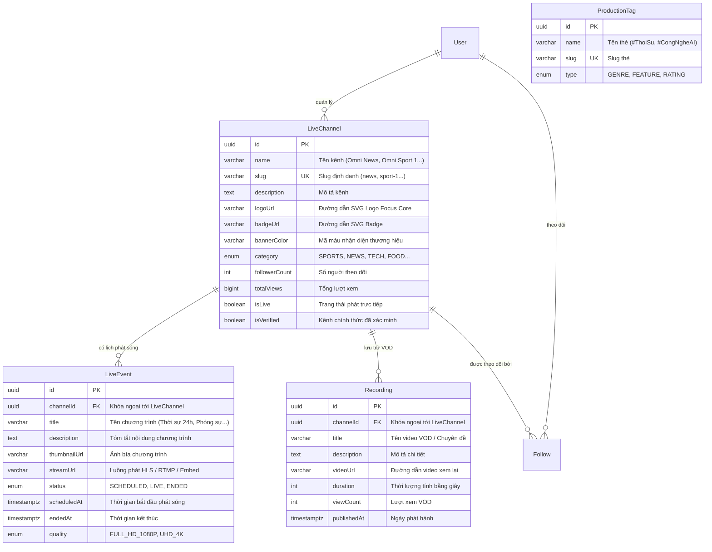

# OmniCast - Kiến Trúc Thu Thập & Tự Động Hóa Nội Dung 12 Kênh (Automated Content & EPG Ingestion)

Tài liệu đặc tả kiến trúc tự động hóa nguồn cấp nội dung, xử lý AI, lập lịch EPG thông minh và đồng bộ cơ sở dữ liệu Supabase cho 12 kênh phát sóng OmniCast.

---

## 1. Kiến Trúc Tổng Thể (System Architecture)



---

## 2. Quy Trình Phân Bổ Nội Dung Tự Động Theo Kênh (Kênh Tin Tức & Chuyên Đề)

Quy trình tự động hóa cho kênh Tin tức, Phóng sự, Tọa đàm và Chuyên đề chuyên biệt:



---

## 3. Thiết Kế Cơ Sở Dữ Liệu Supabase (Entity Relationship Diagram)



---

## 4. Ma Trận Nội Dung 12 Kênh & Khung Giờ 24/7

| STT | Kênh | Thể Loại | Nguồn Cấp Dữ Liệu Tự Động | Cấu Trúc Khung Giờ 24/7 Tiêu Biểu |
| :---: | :--- | :--- | :--- | :--- |
| **01** | **Omni Sport 1** | SPORTS | API-Football, TheSportsDB | **06:00**: Điểm tin sáng • **14:00**: Highlight vòng đấu • **19:00**: Bình luận trước trận • **20:00**: Trực tiếp Ngoại Hạng Anh / C1 |
| **02** | **Omni Sport 2** | SPORTS | Ergast F1, MMA/UFC feeds | **08:00**: Tạp chí tốc độ F1 • **15:00**: Tổng hợp Knockout MMA • **21:00**: Trực tiếp chặng đua F1/MotoGP |
| **03** | **Omni Show** | SHOW | YouTube Creator APIs, Talkshow Feeds | **09:00**: Gameshow tương tác • **14:00**: Sao & Hậu trường • **20:00**: Talkshow độc quyền |
| **04** | **Omni Entertain** | ENTERTAINMENT | Comedy Clips, Sân khấu kịch | **12:00**: Hài kịch thư giãn • **18:00**: Tiểu phẩm viral • **20:30**: Gala cười cuối tuần |
| **05** | **Omni Cine** | CINE | Open Movie DB, Indie Film Archives | **10:00**: Phân tích điện ảnh • **15:00**: Phim ngắn đoạt giải • **20:00**: Bom tấn điện ảnh 4K |
| **06** | **Omni Drama** | DRAMA | Web-drama & Phim bộ dài tập | **11:00**: Web-drama tập mới • **19:30**: Phim truyền hình khung giờ vàng |
| **07** | **Omni News** | NEWS | RSS VnExpress, Tuổi Trẻ, Reuters, AP | **Đầu mỗi giờ**: Flash News (5p) • **07:00**: Thời sự sáng • **12:00**: Chuyển động thế giới • **15:00**: Tài chính & Thị trường • **20:00**: Phóng sự điều tra & Tọa đàm chuyên đề |
| **08** | **Omni Music** | MUSIC | Top Hits API, Live Concert Streams | **07:30**: Acoustic Morning • **16:00**: Top Hits V-Pop & Billboard • **20:30**: Live Concert |
| **09** | **Omni Kids** | KIDS | Hoạt hình 3D Creative Commons | **07:00**: Bé học tiếng Anh • **11:30**: Hoạt hình 3D vui nhộn • **17:30**: Khoa học vui cho bé |
| **10** | **Omni Tech** | TECH | TechCrunch, GitHub, Creator Feeds | **08:30**: Điểm tin công nghệ AI • **14:30**: Unbox & Đánh giá thiết bị • **20:00**: Workshop & Keynote |
| **11** | **Omni Food** | FOOD | MasterChef feeds, Street Food VODs | **06:30**: Bữa sáng dinh dưỡng • **11:30**: Food Tour 3 Miền • **18:30**: Công thức MasterChef |
| **12** | **Omni Discovery** | DOCUMENTARY | Internet Archive, Open Science | **09:00**: Thiên nhiên hoang dã • **16:00**: Hành trình khám phá đại dương • **21:00**: Bí ẩn vũ trụ |

---

## 5. Cấu Hình Đồng Bộ Dữ Liệu Với Supabase

### 1. Đồng bộ Schema lên Supabase
```bash
cd backend
npx prisma db push
```

### 2. Chạy Seeding khởi tạo 12 Kênh và Lịch EPG mẫu
```bash
npx prisma db seed
```
*(Dữ liệu được nạp tự động qua file `backend/prisma/seed.ts` và `backend/prisma/seed.sql`).*
