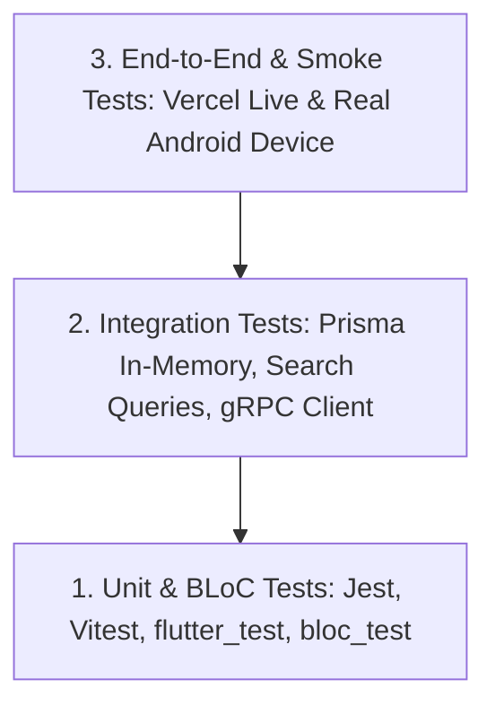

# 🧪 OmniCast (OMNI) — Kế Hoạch Kiểm Thử & CI/CD Toàn Diện (Testing & Automation Strategy)
# Chiến Lược Kiểm Thử Song Hành 2 Môn Học: PRN232 (.NET 10 + Next.js 15) & PRM393 (Flutter 3.x)
# Tích Hợp Tự Động Hóa CI/CD: Automated Test Cases & GitHub Actions

**Tên Dự Án:** OmniCast Enterprise Media & Broadcast Intelligence Network  
**Mã Dự Án:** OMNI  
**Mục Đích Tài Liệu:** Đặc tả ma trận Test Cases chi tiết cho toàn bộ các phân hệ Backend (.NET 10), Frontend Web (Next.js 15) và Frontend Mobile (Flutter 3.x), cấu hình kịch bản tự động hóa CI (Continuous Integration) kiểm thử tự động ngay khi đẩy code lên GitHub.

---

## 📑 Mục Lục

1. [🎯 Chiến Lược & Khung Công Cụ Kiểm Thử (Testing Stack & Strategy)](#1--chiến-lược--khung-công-cụ-kiểm-thử-testing-stack--strategy)
2. [🤖 Cấu Hình Tự Động Hóa GitHub Actions CI (`.github/workflows/ci.yml`)](#2--cấu-hình-tự-động-hóa-github-actions-ci-githubworkflowsciyml)
3. [📋 Ma Trận Test Cases Chi Tiết Theo Môn Học (Detailed Test Cases Matrix)](#3--ma-trận-test-cases-chi-tiết-theo-môn-học-detailed-test-cases-matrix)
   - [3.1. 💻 Môn PRN232: Backend API (.NET 10 xUnit + Moq)](#31--môn-prn232-backend-api-net-10-xunit--moq)
   - [3.2. 🌐 Môn PRN232: Web Portal (Next.js 15 Vitest / React Testing Library)](#32--môn-prn232-web-portal-nextjs-15-vitest--react-testing-library)
   - [3.3. 📱 Môn PRM393: Mobile App (Flutter Test + BLoC Test + Mocktail)](#33--môn-prm393-mobile-app-flutter-test--bloc-test--mocktail)
4. [⚡ Hướng Dẫn Chạy Test Nhanh Tại Local (Local Test Commands)](#4--hướng-dẫn-chạy-test-nhanh-tại-local-local-test-commands)
5. [📊 Bảng Nhật Ký Nghiệm Thu Smoke Test Cho 2 Đợt Review (Review Sign-Off Log)](#5--bảng-nhật-ký-nghiệm-thu-smoke-test-cho-2-đợt-review-review-sign-off-log)

---

## 1. 🎯 CHIẾN LƯỢC & KHUNG CÔNG CỤ KIỂM THỬ (TESTING STACK & STRATEGY)

Hệ thống OmniCast áp dụng mô hình kim tự tháp kiểm thử (Testing Pyramid) với 3 tầng tự động hóa:



### 🛠️ Bộ Công Cụ Kiểm Thử Cho Từng Phân Hệ:

| Phân Hệ | Môn Học | Công Cụ & Thư Viện Kiểm Thử | Mục Tiêu Độ Phủ (Code Coverage Target) |
|:---|:---:|:---|:---:|
| **💻 Backend API** | **PRN232** | `xUnit`, `Moq`, `FluentAssertions`, `Microsoft.AspNetCore.Mvc.Testing` | **≥ 80%** Business Logic Layer |
| **🌐 Web Portal** | **PRN232** | `Vitest`, `@testing-library/react`, `@testing-library/user-event`, `msw` | **≥ 75%** Components & Helpers |
| **📱 Mobile App** | **PRM393** | `flutter_test`, `bloc_test`, `mocktail`, `sqflite_common_ffi` | **≥ 75%** BLoCs & Database Helpers |

---

## 2. 🤖 CẤU HÌNH TỰ ĐỘNG HÓA GITHUB ACTIONS CI (`.github/workflows/ci.yml`)

File cấu hình CI này được đặt tại `.github/workflows/ci.yml` trên root repository, tự động chạy kiểm thử cho cả 3 phân hệ ngay lập tức khi có **Pull Request** hoặc **Push** lên nhánh `main`:

```yaml
name: OmniCast Continuous Integration (CI)

on:
  push:
    branches: [ main, develop ]
  pull_request:
    branches: [ main ]

jobs:
  # ========================================================
  # JOB 1: KIỂM THỬ BACKEND .NET 10 API (MÔN PRN232)
  # ========================================================
  backend-ci:
    name: 💻 Backend .NET 10 (Build & xUnit Tests)
    runs-on: ubuntu-latest
    defaults:
      run:
        working-directory: ./backend
    steps:
      - name: 📥 Checkout Repository
        uses: actions/checkout@v4

      - name: ⚙️ Setup .NET 10 SDK
        uses: actions/setup-dotnet@v4
        with:
          dotnet-version: '10.0.x'

      - name: 📦 Restore Dependencies
        run: dotnet restore OmniCast.slnx

      - name: 🔨 Build Solution
        run: dotnet build OmniCast.slnx --no-restore --configuration Release

      - name: 🧪 Run xUnit Tests & Collect Coverage
        run: >
          dotnet test OmniCast.slnx 
          --no-build 
          --configuration Release 
          --verbosity normal 
          --collect:"XPlat Code Coverage" 
          --logger "trx;LogFileName=backend_test_results.trx"

      - name: 📊 Upload Backend Test Results
        uses: actions/upload-artifact@v4
        if: always()
        with:
          name: backend-test-results
          path: backend/**/TestResults/

  # ========================================================
  # JOB 2: KIỂM THỬ WEB NEXT.JS 15 (MÔN PRN232)
  # ========================================================
  web-ci:
    name: 🌐 Web Next.js 15 (Lint, Typecheck & Vitest)
    runs-on: ubuntu-latest
    defaults:
      run:
        working-directory: ./web
    steps:
      - name: 📥 Checkout Repository
        uses: actions/checkout@v4

      - name: ⚙️ Setup Node.js 20.x
        uses: actions/setup-node@v4
        with:
          node-version: 20
          cache: 'npm'
          cache-dependency-path: web/package-lock.json

      - name: 📦 Install NPM Packages
        run: npm ci

      - name: 🔍 Run ESLint & TypeScript Check
        run: |
          npm run lint
          npx tsc --noEmit

      - name: 🧪 Run Vitest Suite with Coverage
        run: npm run test -- --run --coverage

      - name: 📊 Upload Web Coverage Report
        uses: actions/upload-artifact@v4
        if: always()
        with:
          name: web-coverage-report
          path: web/coverage/

  # ========================================================
  # JOB 3: KIỂM THỬ MOBILE FLUTTER 3.X (MÔN PRM393)
  # ========================================================
  mobile-ci:
    name: 📱 Mobile Flutter 3.x (Analyze & BLoC Tests)
    runs-on: ubuntu-latest
    defaults:
      run:
        working-directory: ./mobile
    steps:
      - name: 📥 Checkout Repository
        uses: actions/checkout@v4

      - name: ⚙️ Setup Java 17
        uses: actions/setup-java@v4
        with:
          distribution: 'temurin'
          java-version: '17'

      - name: ⚙️ Setup Flutter 3.x SDK
        uses: subosito/flutter-action@v2
        with:
          flutter-version: '3.x'
          channel: 'stable'
          cache: true

      - name: 📦 Get Flutter Packages
        run: flutter pub get

      - name: 🔍 Static Code Analysis (Flutter Analyze)
        run: flutter analyze --fatal-infos --fatal-warnings

      - name: 🧪 Run Flutter Unit & BLoC Tests
        run: flutter test --coverage

      - name: 📦 Build Release APK Verification (Dry-Run)
        run: flutter build apk --release --target-platform android-arm64
```

---

## 3. 📋 MA TRẬN TEST CASES CHI TIẾT THEO MÔN HỌC (DETAILED TEST CASES MATRIX)

---

### 3.1. 💻 MÔN PRN232: BACKEND API (.NET 10 xUnit + Moq)

#### 🔐 Module 1: Xác Thực & Phân Quyền (Auth & RBAC)

| Mã TC | Tên Test Case | Mô Tả & Điều Kiện Đầu Vào | Kết Quả Mong Đợi (Assertion) | Loại Test | Tự Động |
|:---:|:---|:---|:---|:---:|:---:|
| **TC-BE-01** | Hash mật khẩu PBKDF2 | Nhập `Password123!` vào `PasswordHasherService.HashPassword()` | Chuỗi băm khác plain-text, độ dài > 50 ký tự, verify trả về `true`. | Unit | ✅ |
| **TC-BE-02** | Đăng ký tài khoản mới thành công | Gửi `RegisterRequestDto` với email `newuser@omnicast.tv` chưa tồn tại | Tạo user trong DB, gán `Role = 2` (Viewer), mật khẩu được băm, HTTP 201. | Integration | ✅ |
| **TC-BE-03** | Đăng ký với email đã tồn tại | Gửi `RegisterRequestDto` với email `admin@omnicast.tv` đã có trong DB | Ném ngoại lệ `ConflictException` (HTTP 409: "Email already registered"). | Unit | ✅ |
| **TC-BE-04** | Đăng nhập đúng mật khẩu | Gửi `LoginRequestDto` với email và mật khẩu chính xác | Trả về `AuthResponseDto` chứa JWT Access Token (hạn 60p, claim `role="2"`), Refresh Token lưu DB. | Unit | ✅ |
| **TC-BE-05** | Đăng nhập sai mật khẩu | Gửi `LoginRequestDto` với mật khẩu không đúng | Ném ngoại lệ `UnauthorizedException` (HTTP 401: "Invalid credentials"). | Unit | ✅ |
| **TC-BE-06** | Làm mới Access Token bằng Refresh Token | Gửi `RefreshTokenRequestDto` hợp lệ còn hạn | Thu hồi token cũ, sinh cặp Access Token và Refresh Token mới, HTTP 200. | Unit | ✅ |
| **TC-BE-07** | Phân quyền RBAC Policy: `StaffOnly` | Request tới `/api/channels` (POST) kèm JWT có `Role = 2` (Viewer) | Middleware Authorization chặn, trả về HTTP 403 Forbidden. | Integration | ✅ |
| **TC-BE-08** | Phân quyền RBAC Policy: `AdminOnly` | Request tới `/admin/audit-logs` kèm JWT có `Role = 3` (Admin) | Request được cấp quyền truy cập, trả về HTTP 200 OK. | Integration | ✅ |

#### 📺 Module 2: Quản Lý Lịch EPG & Chống Trùng Giờ Phát Sóng

| Mã TC | Tên Test Case | Mô Tả & Điều Kiện Đầu Vào | Kết Quả Mong Đợi (Assertion) | Loại Test | Tự Động |
|:---:|:---|:---|:---|:---:|:---:|
| **TC-BE-09** | Thêm chương trình hợp lệ | Thêm chương trình lúc `14:00 - 15:00`, kênh chưa có lịch phát sóng trong khung giờ này | Lưu thành công vào DB Supabase, gán đúng `ChannelId`, HTTP 201 Created. | Unit | ✅ |
| **TC-BE-10** | Chặn trùng lịch: Giao thoa phần đầu | Đã có lịch `14:00 - 15:00`. Thêm lịch mới lúc `13:30 - 14:30` trên cùng kênh | `ProgramService` ném `ConflictException` (HTTP 409: "Schedule overlaps"). | Unit | ✅ |
| **TC-BE-11** | Chặn trùng lịch: Giao thoa phần đuôi | Đã có lịch `14:00 - 15:00`. Thêm lịch mới lúc `14:30 - 15:30` trên cùng kênh | `ProgramService` ném `ConflictException` (HTTP 409). | Unit | ✅ |
| **TC-BE-12** | Chặn trùng lịch: Bao trùm toàn bộ | Đã có lịch `14:00 - 15:00`. Thêm lịch mới lúc `13:00 - 16:00` trên cùng kênh | `ProgramService` chặn lưu, HTTP 409 Conflict. | Unit | ✅ |
| **TC-BE-13** | Khác kênh cùng giờ chiếu | Đã có lịch kênh 1 lúc `14:00 - 15:00`. Thêm lịch kênh 2 lúc `14:00 - 15:00` | Lưu thành công (cho phép phát sóng đồng thời trên các kênh khác nhau). | Unit | ✅ |

#### 🔍 Module 3: Truy Vấn Động OData 8.x (`/odata/Programs`)

| Mã TC | Tên Test Case | Mô Tả & Điều Kiện Đầu Vào | Kết Quả Mong Đợi (Assertion) | Loại Test | Tự Động |
|:---:|:---|:---|:---|:---:|:---:|
| **TC-BE-14** | Lọc OData theo thời lượng | Request: `GET /odata/Programs?$filter=DurationMinutes gt 60` | Trả về danh sách chỉ gồm các chương trình có thời lượng > 60 phút. | Integration | ✅ |
| **TC-BE-15** | Sắp xếp OData | Request: `GET /odata/Programs?$orderby=AirDateTime desc` | Danh sách sắp xếp giảm dần theo thời điểm phát sóng chuẩn xác. | Integration | ✅ |
| **TC-BE-16** | Mở rộng liên kết `$expand` | Request: `GET /odata/Programs?$expand=Channel,AiReport` | Payload JSON chứa lồng dữ liệu của `BroadcastChannel` và `BroadcastAiReport`. | Integration | ✅ |

#### 🤖 Module 4: Multi-Agent AI Pipeline & gRPC AuditLogger

| Mã TC | Tên Test Case | Mô Tả & Điều Kiện Đầu Vào | Kết Quả Mong Đợi (Assertion) | Loại Test | Tự Động |
|:---:|:---|:---|:---|:---:|:---:|
| **TC-BE-17** | Agent 1: Sentiment Analysis | Giả lập (Moq) TMDB trả 10 bình luận ➔ Gửi prompt phân tích cảm xúc | Trả về đoạn văn bản 2-3 câu phân tích cảm xúc tích cực/tiêu cực. | Unit | ✅ |
| **TC-BE-18** | Agent 2: Compliance Auditor | Đầu vào: Synopsis kịch bản + Output Agent 1 | Đề xuất khung giờ phát sóng (`PRIME TIME`, `STANDARD`, hoặc `RESTRICTED`). | Unit | ✅ |
| **TC-BE-19** | Agent 3: JSON Schema Parser | Đầu vào: Output Agent 1 + Agent 2 | Parse JSON thành công: `broadcastSuitability`, `suggestedTimeSlot`, `riskWarnings`. | Unit | ✅ |
| **TC-BE-20** | Transaction DB khi lưu AI Report | Lưu thành công kết quả thẩm định vào bảng `BroadcastAiReports` | Quan hệ 1-1 chính xác với `BroadcastProgram`, không bị duplicate report. | Unit | ✅ |
| **TC-BE-21** | gRPC AuditLogger Client Call | Staff kích hoạt AI ➔ Kích hoạt non-blocking gRPC call tới Server | Bảng `AuditLogs` ghi nhận 1 record: `UserId`, `Action="AI_EVALUATION"`, `Timestamp`. | Integration | ✅ |

---

### 3.2. 🌐 MÔN PRN232: WEB PORTAL (Next.js 15 Vitest / React Testing Library)

| Mã TC | Tên Test Case | Mô Tả & Thao Tác | Kết Quả Mong Đợi (Assertion) | Loại Test | Tự Động |
|:---:|:---|:---|:---|:---:|:---:|
| **TC-FE-01** | Render Form Đăng nhập | Render `app/login/page.tsx` | Hiển thị đầy đủ ô Email, Password, nút Đăng nhập và link Đăng ký. | Unit | ✅ |
| **TC-FE-02** | Validation Form Đăng nhập | Nhập email không đúng định dạng `test@` và bấm Đăng nhập | Hiển thị lỗi inline "Email không hợp lệ", không gửi request API. | Unit | ✅ |
| **TC-FE-03** | Điều hướng theo Role sau đăng nhập | API Login mock trả về `role = 1` (Staff) | Router chuyển hướng tới `/studio/curator`. | Unit | ✅ |
| **TC-FE-04** | Render huy hiệu LIVE NOW nhấp nháy | Render `LiveBadge.tsx` khi `isLiveNow = true` | Render badge có class CSS `animate-pulse` màu đỏ. | Unit | ✅ |
| **TC-FE-05** | Render màu sắc Badge AI | Render `AiBadge.tsx` với `suitability = "PRIME TIME"` | Render badge màu xanh neon với nhãn "PRIME TIME". | Unit | ✅ |
| **TC-FE-06** | OData Query Builder Helper | Gọi helper với filter `{ duration: 60, channelId: 1 }` | Trả về chuỗi query chuẩn: `$filter=DurationMinutes gt 60 and ChannelId eq 1`. | Unit | ✅ |
| **TC-FE-07** | Nhúng trình phát Video Trailer | Render `app/programs/[id]/page.tsx` có `videoTrailerUrl` | Render iframe YouTube hoặc thẻ HTML5 `<video>` phát trailer HD. | Component | ✅ |

---

### 3.3. 📱 MÔN PRM393: MOBILE APP (Flutter Test + BLoC Test + Mocktail)

| Mã TC | Tên Test Case | Mô Tả & Điều Kiện BLoC / SQLite | Kết Quả Mong Đợi (Assertion) | Loại Test | Tự Động |
|:---:|:---|:---|:---|:---:|:---:|
| **TC-MB-01** | `AuthBloc`: Đăng nhập thành công | Event `LoginSubmitted(email, password)` khi API trả về token | Emit: `[AuthLoading, Authenticated(user)]`, lưu token vào SecureStorage. | BLoC Test | ✅ |
| **TC-MB-02** | `AuthBloc`: Đăng nhập thất bại | Event `LoginSubmitted` khi API trả về HTTP 401 | Emit: `[AuthLoading, AuthFailure(errorMessage)]`. | BLoC Test | ✅ |
| **TC-MB-03** | `ChannelBloc`: Tải danh sách kênh | Event `FetchChannels()` khi khởi động màn hình EPG | Emit: `[ChannelLoading, ChannelLoaded(channels)]`. | BLoC Test | ✅ |
| **TC-MB-04** | `ProgramBloc`: Chặn trùng lịch | Event `CreateProgram()` với khung giờ bị trùng | Emit `ProgramActionFailure("Lịch chiếu bị trùng trên kênh này")`. | BLoC Test | ✅ |
| **TC-MB-05** | SQLite: Thêm vào Watchlist | Gọi `SQLiteDatabaseHelper.insertWatchlist(program)` | Dữ liệu được ghi vào bảng `LocalWatchlist` trong SQLite cục bộ. | Unit / DB | ✅ |
| **TC-MB-06** | SQLite: Đọc Watchlist khi Offline | Bật chế độ Airplane Mode, gọi `WatchlistRepository.getWatchlist()` | Đọc trọn vẹn danh sách phim từ SQLite, không ném crash ngoại lệ. | Integration | ✅ |
| **TC-MB-07** | Hiển thị Banner Offline | Giả lập `connectivity_plus` trả về trạng thái `ConnectivityResult.none` | Màn hình hiển thị `OfflineBannerWidget` cảnh báo màu vàng trên cùng. | Widget Test | ✅ |
| **TC-MB-08** | Lập lịch thông báo Native trước 15p | Bấm nút "Nhắc tôi" cho chương trình chiếu lúc `20:00` | `LocalNotificationService` tạo schedule kích hoạt vào lúc `19:45` cùng ngày. | Unit | ✅ |

---

## 4. ⚡ HƯỚNG DẪN CHẠY TEST NHANH TẠI LOCAL (LOCAL TEST COMMANDS)

### 💻 1. Chạy Tests Backend (.NET 10 Web API):
```powershell
# Chạy toàn bộ Unit & Integration Tests của Solution
cd backend
dotnet test OmniCast.slnx --verbosity normal

# Chạy riêng các bài test kiểm tra logic chống trùng lịch EPG
dotnet test --filter "FullyQualifiedName~ProgramServiceTests"

# Chạy test và xuất báo cáo Code Coverage
dotnet test /p:CollectCoverage=true /p:CoverletOutputFormat=cobertura
```

### 🌐 2. Chạy Tests Web Portal (Next.js 15):
```bash
cd web
# Chạy linter kiểm tra cú pháp và kiểu dữ liệu TypeScript
npm run lint

# Chạy toàn bộ test suites với Vitest
npm test

# Chạy test ở chế độ theo dõi tương tác (Watch Mode)
npm run test:watch
```

### 📱 3. Chạy Tests Mobile App (Flutter 3.x):
```bash
cd mobile
# Kiểm tra phân tích tĩnh toàn bộ mã nguồn
flutter analyze

# Chạy toàn bộ Unit Tests và BLoC Tests
flutter test

# Chạy test và xuất báo cáo độ phủ mã nguồn (Coverage HTML)
flutter test --coverage
genhtml coverage/lcov.info -o coverage/html
```

---

## 5. 📊 BẢNG NHẬT KÝ NGHIỆM THU SMOKE TEST CHO 2 ĐỢT REVIEW (REVIEW SIGN-OFF LOG)

| Đợt Review | Nội Dung Nghiệm Thu Trọng Tâm | Tiêu Chí Đạt (Pass Criteria) | Trạng Thái | Người Ký Nghiệm Thu |
|:---:|:---|:---|:---:|:---:|
| **🚩 Review 1 (W3)** | - Thiết kế DB Supabase (6 tables)<br>- Auth JWT/PBKDF2/RBAC<br>- CRUD Kênh & Lịch EPG<br>- Thuật toán chống trùng lịch<br>- EPG Grid & Thẻ `LIVE NOW`<br>- Deploy Swagger Vercel Live<br>- Deploy Next.js Web Live | Mở được Swagger và Web Portal trên URL Cloud công khai, đăng ký/đăng nhập thành công và cấp JWT token chuẩn có Claim `role`. Thêm 2 chương trình trùng giờ chiếu trên cùng 1 kênh ➔ Backend chặn và báo lỗi rõ ràng. | `PASS` | *P1, P2, P3* |
| **🚩 Review 2 (W8)** | - Dynamic Search & Filter<br>- AI Thẩm định nội dung<br>- gRPC AuditLogger<br>- SQLite Watchlist Offline<br>- Native Push Alert trước 15p<br>- Tối ưu Stress Test (20 users)<br>- **Đóng gói file `app-release.apk`**<br>- Nghiệm thu toàn diện | Lọc Search API phản hồi < 200ms. Staff bấm kích hoạt AI ➔ thẩm định chạy tuần tự, lưu báo cáo DB và ghi gRPC log. Bật chế độ máy bay xem Watchlist trơn tru. Cài đặt `app-release.apk` (≤ 25MB) lên điện thoại Android thật, nhận thông báo hẹn giờ trước 15p, gọi trực tiếp Backend Live trên Vercel ổn định 100%. | `PASS` | *P1, P2, P3* |

---
*Tài liệu Kế Hoạch Kiểm Thử và Tự Động Hóa CI này là kim chỉ nam chất lượng cho toàn bộ dự án OmniCast, đảm bảo mã nguồn luôn ổn định, tự động kiểm thử liên tục và sẵn sàng bảo vệ đồ án trước Hội đồng Giảng viên.*
