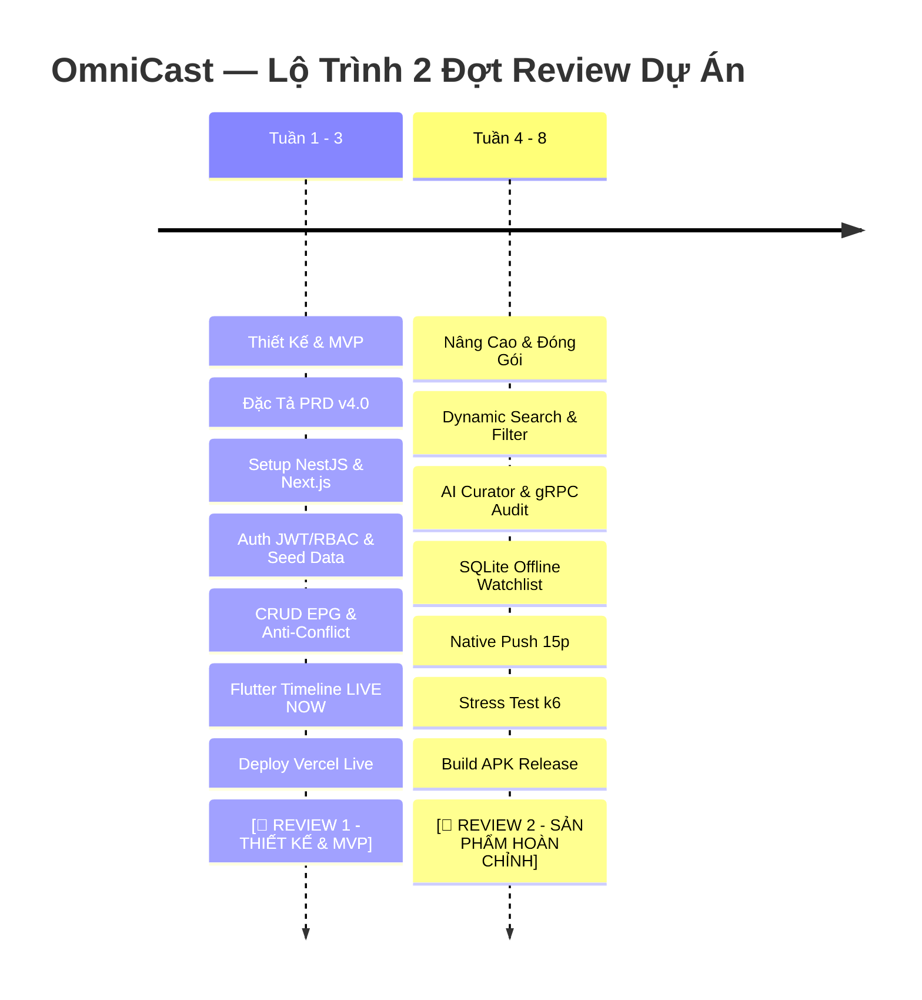

# 📺 OmniCast — Work Breakdown Structure (WBS) Chi Tiết
# Kế Hoạch Triển Khai Kỹ Thuật Chi Tiết Cho Từng Môn Học (PRN232 & PRM393)
# (8 - 10 Tuần — 2 Đợt Review Tiến Độ — Kịch Bản 4 Thành Viên)
# Kiến Trúc Hiện Đại: NestJS 11 (Backend Web API) + Next.js 15 (Frontend Web) + Flutter 3.x (Mobile) + Supabase (Database & Storage) + Vercel Cloud

**Tên Dự Án:** OmniCast Enterprise Media & Broadcast Intelligence Network  
**Mã Dự Án:** OMNI  
**Quy Mô Nhân Sự:** **4 Thành Viên (Team of 4)**  
**Phân Định Theo 2 Môn Học & Khung Công Nghệ:**
- 💻🌐 **Môn PRN232 (Modern Web API Core & Web Application):**
  - **Backend Web API:** **NestJS 11+ (TypeScript)** kiến trúc Modular Enterprise, Prisma ORM, Swagger/OpenAPI (`@nestjs/swagger`), JWT & Argon2/PBKDF2 RBAC, gRPC Server/Client, Supabase PostgreSQL, Deploy Serverless / Cloud API trên **Vercel** (`https://omnicast-api.vercel.app/swagger`).
  - **AI Intelligence & Audit Logger:** Tích hợp OpenAI GPT-4o & TMDB API thẩm định phát sóng 3 Agent, gRPC AuditLogger Microservice ghi vết kiểm toán Supabase.
  - **Frontend Web Portal:** **Next.js 15 (App Router, React 19, TypeScript, Tailwind CSS Cinema Dark)** Deploy CI/CD trên **Vercel** (`https://omnicast-fe.vercel.app`).
- 📱 **Môn PRM393 (Mobile App Development with Flutter):**
  - **Front-End Mobile App:** **Flutter 3.x / Dart 3.x** kiến trúc BLoC State Management, Offline-First SQLite Local Storage (`omnicast_local.db`), Native Scheduled Local Notifications trước 15 phút, Build bản cài đặt chính thức `app-release.apk` cho Android & hỗ trợ iOS.

---

## 🎯 Nguyên Tắc Phân Bổ Nhân Lực 4 Thành Viên (Đặc Thù Môn Học)

> 💡 **Quy Tắc Phân Công Đặc Thù:**
> - **Thành viên 1, 2, 3 (P1, P2, P3):** Đang học cả 2 môn **PRN232 & PRM393** ➔ Đảm nhận cân bằng khối lượng Web/Backend và chia đều 3 module chính trên Mobile Flutter (~33.3% Mobile/người).
> - **Thành viên 4 (P4):** **ĐÃ QUA MÔN PRM393** ➔ **Chuyên trách toàn bộ PRN232** (~95-100% khối lượng tập trung vào gRPC AuditLogger Microservice, Cloud Vercel CI/CD Deployment, Seeding Data toàn diện, Rate Limiting Security, Stress Testing và QA). Hỗ trợ kiểm thử Smoke Test API Contract với Mobile Team.

---

## 🗓️ Lộ Trình 2 Đợt Review Tiến Độ Chuẩn

1. **🚩 REVIEW 1 (Tuần 3): THIẾT KẾ & MVP (BẮT ĐẦU CODE)**
   - Hoàn thiện tài liệu PRD, WBS phân công 3 người, thiết kế cơ sở dữ liệu Prisma Supabase (6 Models), Wireframes UI Cinema Dark, Protobuf specs gRPC, 52 Test Cases và kế hoạch nghiệm thu QA.
   - Khởi tạo source code, Migrate DB Supabase, Auth JWT/Argon2/RBAC, Seed Data toàn diện, CRUD Kênh & Chương trình + Thuật toán chống trùng lịch phát sóng, Giao diện Web EPG Grid 24h, Ứng dụng Flutter EPG Timeline cuộn 2 chiều hiển thị `LIVE NOW`, Video Trailer HD, Deploy Backend API & Frontend Web lên Vercel Live.
2. **🚩 REVIEW 2 (Tuần 8): SẢN PHẨM HOÀN CHỈNH & BẢO VỆ ĐỒ ÁN (FINAL RELEASE)**
   - Dynamic Search & Filter Engine, AI Curator thẩm định phát sóng, gRPC AuditLogger Dashboard, SQLite Offline-First (`omnicast_local.db`), Native Local Notification hẹn giờ 15 phút, Rate Limiting, Stress Test k6, Đóng gói file cài đặt `app-release.apk` và bảo vệ trước Hội đồng Giảng viên.

---

## 📊 Bảng Phân Bổ Nhân Lực Theo Môn Học (Overview Matrix — 4 Thành Viên)

| Thành Viên | Trọng Trách Kỹ Thuật Chính | 💻🌐 Môn PRN232 (NestJS API + Next.js Web) | 📱 Môn PRM393 (Flutter Mobile App) | Tổng Số Tasks | Tỷ Trọng |
|:---|:---|:---:|:---:|:---:|:---:|
| **👤 Member 1 (P1) Tech Lead & Search Engine** | • NestJS Architecture Setup, Prisma Schema Supabase (6 Models) • Auth Module JWT, PBKDF2/Argon2 & RBAC Guards (1, 2, 3) • Advanced Search & Filter Engine (`$filter`, `$orderby`) • Next.js Base Auth + Trang Search UI (`app/search`) | • Flutter BLoC Architecture Setup & Theme Cinema Dark • Flutter BLoC Auth (Login, Register, Splash) • Mobile Advanced Search Engine & Filter Chips • Secure Token Storage Mobile | **50 tasks** *(25 PRN / 25 PRM)* | **25%** |
| **👤 Member 2 (P2) Broadcast Content & Notifications** | • NestJS CRUD Kênh & Chương trình (`ChannelsModule`, `ProgramsModule`) • **Thuật toán chống trùng lịch phát sóng** (`ConflictException`) • Swagger Decorators & Validation DTOs • Next.js EPG Grid 24h, Modal CRUD & Trailer Player | • Flutter EPG Timeline `LIVE NOW` (Horizontal & Vertical) • Featured Carousel & Pull-to-Refresh Feed • **Native Local Notification hẹn giờ trước 15p** • Hero Animation & Video Player Trailer | **50 tasks** *(25 PRN / 25 PRM)* | **25%** |
| **👤 Member 3 (P3) AI Integration & Mobile Offline Storage** | • NestJS `AiCuratorModule` (kết nối OpenAI/TMDB & lưu Supabase Transaction) • Next.js AI Curator Studio (`app/studio/curator`) • Next.js Profile page & Status Badges (`AiBadge.tsx`) • gRPC AuditLogger Microservice & Dashboard | • Flutter AI Curator Studio (`StaffCuratorScreen`) • **SQLite Local Storage (`omnicast_local.db`)** • Offline Watchlist BLoC & Offline Banner Alert • **Đóng gói bản cài đặt APK Release (`app-release.apk`)** | **50 tasks** *(25 PRN / 25 PRM)* | **25%** |
| **👤 Member 4 (P4) gRPC, DevOps Vercel, Data Seed & Security *(Chuyên trách PRN232 — Đã qua PRM393)*** | • **gRPC AuditLogger Microservice & `audit_logger.proto`** • `seed.ts` nạp dữ liệu toàn diện (Admin, Kênh, Chương trình) • Next.js Admin Logs Viewer (`app/admin/audit-logs`) • **Cấu hình Vercel CI/CD cho Backend API & Frontend Web** • Rate Limiting Throttler, Helmet, Stress Test (k6) & Unit Tests | • Cấu hình Base URL API Live Vercel cho Mobile • Hỗ trợ Smoke Test API Contract với Mobile Team | **50 tasks** *(48 PRN / 2 PRM)* | **25%** |
| **TỔNG CỘNG TOÀN BỘ DỰ ÁN** | | **123 tasks** | **77 tasks** | **200 TASKS** | **100%** |

---

## 🛡️ BẢNG QUY ĐỊNH MÃ SỐ ROLE CHUẨN TOÀN HỆ THỐNG (SYSTEM ROLES SPECIFICATION)

| Mã Số Role (`int`) | Định Danh Role | Tên Vai Trò Thực Tế | Phạm Vi Quyền Hạn Kỹ Thuật | Điểm Đến Sau Đăng Nhập |
|:---:|:---|:---|:---|:---|
| **`Role = 1`** | **`Staff`** | **Biên Tập Viên Phát Sóng (Curator)** | - CRUD Kênh truyền hình (`BroadcastChannels`) - CRUD Chương trình & Lập lịch EPG (`BroadcastPrograms`) - **Kích hoạt thẩm định AI nội dung** - Xuất bản lịch phát sóng | **Web:** `/studio/curator` **Mobile:** `StaffCuratorScreen` |
| **`Role = 2`** | **`Viewer`** | **Khán Giả Đăng Ký (Audience)** | - Xem EPG thời gian thực (`LIVE NOW`) - Lọc và tìm kiếm nâng cao, xem Trailer HD - **Lưu Watchlist ngoại tuyến (SQLite)** - **Hẹn giờ Native Push trước 15 phút** | **Web:** `/epg` **Mobile:** `HomeScreen` |
| **`Role = 3`** | **`Admin`** | **Quản Trị Viên (System Admin)** | - Quản trị tài khoản (`UserAccounts` CRUD) - Cấp quyền/Đổi vai trò giữa Staff (1) và Viewer (2) - **Giám sát vết kiểm toán gRPC (`AuditLogs`)** | **Web:** `/admin/dashboard` **Mobile:** `AdminHubScreen` |
| **`Role = 0`** | **`Guest`** | **Khách Vãng Lai** | - Xem EPG và trailer công khai (Read-Only) | **Web:** `/` **Mobile:** `LoginScreen` / `GuestFeed` |

---

## 🗓️ Danh Sách Đầu Việc Kỹ Thuật Theo 2 Đợt Review (Review Milestones — 4 Thành Viên)

---

### 🚩 ĐỢT REVIEW 1 (Tuần 3): THIẾT KẾ & MVP (BẮT ĐẦU CODE)
*Trọng tâm:* **Thẩm định và chốt toàn bộ yêu cầu dự án**, thiết kế cơ sở dữ liệu 6 Models Prisma Supabase, thiết kế kiến trúc Modular NestJS & BLoC Flutter, Wireframes UI/UX Cinema Dark, đặc tả Protobuf gRPC, xây dựng bộ 52 Test Cases và kế hoạch nghiệm thu. **Bắt đầu triển khai code từ Tuần 3.**

#### 👤 Member 1 (P1) — Tech Lead & Auth
- [ ] 📄 **[PRN232 - Design]** Hoàn thiện tài liệu Đặc tả Kiến trúc Backend NestJS 11 Modular và Luồng dữ liệu Auth JWT/Argon2/PBKDF2.
- [ ] 📄 **[PRN232 - Design]** Thiết kế chi tiết Prisma Schema (`schema.prisma`): Khai báo đủ 6 Models (`UserAccount`, `BroadcastChannel`, `BroadcastProgram`, `ProductionTag`, `BroadcastAiReport`, `AuditLog`) với đầy đủ quan hệ 1-N, N-N, 1-1 và Unique Indexes.
- [ ] 📄 **[PRN232 - Design]** Thiết kế bảng đặc tả DTOs và Validation Rules cho Auth (`RegisterDto`, `LoginDto`, `RefreshTokenDto`) và RBAC Guards (Roles 1, 2, 3).
- [ ] 📄 **[PRN232 - Design]** Thiết kế luồng điều hướng Frontend Web Next.js theo Role và đặc tả giao diện Cinema Dark Theme (`#0F1016`).
- [ ] 📱 **[PRM393 - Design]** Thiết kế kiến trúc thư mục chuẩn Flutter BLoC Pattern (`core/`, `data/`, `logic/`, `presentation/`).
- [ ] 📱 **[PRM393 - Design]** Thiết kế Wireframe/UI Mockups cho màn hình Splash, Login, Register trên Mobile.
- [ ] 📱 **[PRM393 - Design]** Đặc tả kỹ thuật quản lý State `AuthBloc` và giải pháp lưu trữ an toàn `flutter_secure_storage`.

#### 👤 Member 2 (P2) — Broadcast Content Developer
- [ ] 📄 **[PRN232 - Design]** Đặc tả luồng nghiệp vụ quản lý Kênh (`BroadcastChannels`) và Chương trình phát sóng (`BroadcastPrograms`).
- [ ] 📄 **[PRN232 - Design]** **Thiết kế thuật toán chống xung đột lịch phát sóng:** Đặc tả logic toán học kiểm tra giao thoa khoảng thời gian `[airDateTime, airDateTime + durationMinutes]` trên cùng kênh chiếu.
- [ ] 📄 **[PRN232 - Design]** Thiết kế Wireframe giao diện Lưới lịch phát sóng EPG Grid Schedule 24h và Modal thêm/sửa chương trình trên Web Next.js.
- [ ] 📱 **[PRM393 - Design]** Thiết kế Wireframe giao diện EPG Timeline cuộn 2 chiều (Kênh ngang + Lịch dọc) và Video Trailer Player trên Flutter.
- [ ] 📱 **[PRM393 - Design]** Thiết kế đặc tả kỹ thuật tính năng Thông báo đẩy Native hẹn giờ xem trước 15 phút (`flutter_local_notifications`).

#### 👤 Member 3 (P3) — AI Integration & Mobile Offline Storage
- [ ] 📄 **[PRN232 - Design]** Đặc tả quy trình Thẩm định phát sóng AI (3 Agent: Sentiment Analyst, Compliance Auditor, Editorial Director) kết hợp OpenAI GPT-4o & TMDB Reviews.
- [ ] 📄 **[PRN232 - Design]** Thiết kế Wireframe giao diện Studio Biên tập AI (`/studio/curator`) dành riêng cho Staff trên Web Next.js.
- [ ] 📱 **[PRM393 - Design]** Thiết kế cấu trúc cơ sở dữ liệu SQLite cục bộ `omnicast_local.db` gồm 2 bảng `LocalWatchlist` và `EpgCache`.
- [ ] 📱 **[PRM393 - Design]** Đặc tả kỹ thuật cơ chế Offline-First và hiển thị Offline Banner khi mất kết nối mạng.

#### 👤 Member 4 (P4) — gRPC, DevOps Vercel, Data Seed & Security *(Chuyên trách PRN232)*
- [ ] 📄 **[PRN232 - Design]** Thiết kế file đặc tả Protobuf gRPC `audit_logger.proto` cho microservice ghi vết kiểm toán Supabase.
- [ ] 📄 **[PRN232 - Design]** Thiết kế kịch bản dữ liệu mẫu toàn diện `seed.ts` (Admin, Staff, Viewer accounts, 5 Kênh truyền hình thực tế, bộ thẻ tags, 15 chương trình mẫu có video trailer HD).
- [ ] 📄 **[PRN232 - Design]** Thiết kế kiến trúc triển khai Cloud Vercel CI/CD cho cả Backend Web API (`https://omnicast-api.vercel.app`) và Frontend Web Portal (`https://omnicast-fe.vercel.app`).
- [ ] 📄 **[PRN232 - Design]** Xây dựng bộ tài liệu 52 Test Cases (`TEST_CASES.md`) và Kế hoạch kiểm thử nghiệm thu QA (`Testing_Guide.md`).

---

### 🚩 ĐỢT REVIEW 2 (Tuần 8): SẢN PHẨM HOÀN CHỈNH & BẢO VỆ ĐỒ ÁN (FINAL RELEASE)
*Trọng tâm:* Hoàn thiện toàn bộ tính năng nâng cao: Dynamic Search & Filter Engine, AI Curator thẩm định phát sóng, gRPC AuditLogger Microservice & Admin Dashboard, **SQLite Offline-First Watchlist**, **Native Local Notification hẹn giờ trước 15 phút**, Rate Limiting Throttler, Helmet Security, **Stress Test k6**, **Đóng gói `app-release.apk`**, nghiệm thu toàn diện và bảo vệ trước Hội đồng.

#### 👤 Member 1 (P1) — Tech Lead & Auth
- [ ] 💻 **[PRN232 - NestJS]** Khởi tạo dự án NestJS 11+ (`backend/`) với TypeScript, cấu hình `tsconfig.json` và cài đặt packages cốt lõi.
- [ ] 💻 **[PRN232 - NestJS]** Implement `prisma/schema.prisma` 6 Models, chạy migration `init_schema` cập nhật lên Supabase Cloud PostgreSQL.
- [ ] 💻 **[PRN232 - NestJS]** Implement `PrismaService.ts`, `AuthModule`: `AuthService.ts`, `AuthController.ts`, `JwtStrategy.ts`, `RolesGuard.ts`, `@Roles()` Decorator.
- [ ] 💻 **[PRN232 - NestJS]** Cấu hình Swagger OpenAPI UI trong `main.ts` với nút `Authorize` Bearer JWT (`https://omnicast-api.vercel.app/swagger`).
- [ ] 🌐 **[PRN232 - Next.js]** Khởi tạo ứng dụng Next.js 15 (`frontend/`), cấu hình Cinema Dark Theme, implement `app/login/page.tsx`, `app/register/page.tsx` và `AuthContext.tsx`.
- [ ] 🌐 **[PRN232 - Next.js]** Implement `api-client.ts` Axios instance tự động đính kèm Token và xử lý interceptor 401.
- [ ] 🌐 **[PRN232 - Next.js]** Implement Navbar và Sidebar responsive chuyển đổi phân luồng quyền.
- [ ] 📱 **[PRM393 - Flutter]** Khởi tạo Flutter 3.x project `mobile/`, cấu hình dependencies BLoC, Dio, SecureStorage, Google Fonts.
- [ ] 📱 **[PRM393 - Flutter]** Implement `AppTheme.dart`, `TokenStorageHelper.dart`, `DioClient.dart` kèm `AuthInterceptor.dart` trỏ tới API Live trên Vercel.
- [ ] 📱 **[PRM393 - Flutter]** Implement `AuthBloc.dart`, `SplashScreen.dart`, `LoginScreen.dart`, `RegisterScreen.dart` trên Mobile.
- [ ] 📱 **[PRM393 - Flutter]** Implement Reusable Widgets: `CustomTextField.dart`, `PrimaryGradientButton.dart`.

#### 👤 Member 2 (P2) — Broadcast Content Developer (Chủ trì Module Kênh & Lịch EPG)
- [ ] 💻 **[PRN232 - NestJS]** Implement `ChannelsModule` và `ProgramsModule` (Controllers, Services, Repositories).
- [ ] 💻 **[PRN232 - NestJS]** Implement DTOs có Swagger Decorators & Validation: `CreateChannelDto`, `CreateProgramDto`, `UpdateProgramDto`, `ProgramFilterDto`.
- [ ] 💻 **[PRN232 - NestJS]** **Triển khai thuật toán chống xung đột lịch phát sóng:** Kiểm tra giao thoa khung giờ chiếu trên cùng kênh ➔ Từ chối lưu và ném `ConflictException` (HTTP 409).
- [ ] 💻 **[PRN232 - NestJS]** Gắn Roles Guard `@Roles('Staff', 'Admin')` bảo vệ các endpoint tạo/sửa/xóa Channels và Programs.
- [ ] 🌐 **[PRN232 - Next.js]** Implement trang `app/epg/page.tsx`: Bảng lịch EPG Grid Schedule 24h đa kênh.
- [ ] 🌐 **[PRN232 - Next.js]** Implement `ProgramModal.tsx` cho Staff thêm/sửa chương trình kèm DateTimePicker và validation chống trùng giờ.
- [ ] 🌐 **[PRN232 - Next.js]** Implement `LiveBadge.tsx` nhấp nháy đỏ cho chương trình đang chiếu `LIVE NOW`.
- [ ] 🌐 **[PRN232 - Next.js]** Implement trang `app/programs/[id]/page.tsx` phát trailer video HD nhúng.
- [ ] 📱 **[PRM393 - Flutter]** Implement `ChannelBloc.dart`, `ProgramBloc.dart` và Data Models (`ChannelModel.dart`, `ProgramModel.dart`).
- [ ] 📱 **[PRM393 - Flutter]** Implement `EpgTimelineScreen.dart`: Thanh chọn kênh cuộn ngang và danh sách lịch chiếu cuộn dọc.
- [ ] 📱 **[PRM393 - Flutter]** Implement `ProgramDetailScreen.dart` phát trailer YouTube nhúng và widget `LiveNowPulseWidget.dart`.
- [ ] 📱 **[PRM393 - Flutter]** Implement `HomeFeedScreen.dart` với `FeaturedCarousel.dart` trượt tự động và Pull-to-Refresh.

#### 👤 Member 3 (P3) — AI Integration & Mobile Offline Storage
- [ ] 🌐 **[PRN232 - Next.js]** Implement trang `app/profile/page.tsx` hiển thị thông tin user và Role Badge, tích hợp toast popup `sonner`.
- [ ] 🌐 **[PRN232 - Next.js]** Implement hiệu ứng Shimmer Loading Skeleton khi tải danh sách kênh và lịch phát sóng.
- [ ] 📱 **[PRM393 - Flutter]** Cài đặt thư viện `pretty_dio_logger` debug API, cấu hình Launcher Icon OmniCast cho Android.
- [ ] 📱 **[PRM393 - Flutter]** Implement `ProfileScreen.dart`: Hiển thị thông tin cá nhân, Badge Role và nút Đăng xuất xóa cache.
- [ ] 📱 **[PRM393 - Flutter]** Implement giao diện xử lý lỗi rớt mạng (Network Error View) và Responsive xoay ngang khi xem trailer.

#### 👤 Member 4 (P4) — gRPC, DevOps Vercel, Data Seed & Security *(Chuyên trách PRN232)*
- [ ] 💻 **[PRN232 - NestJS]** **Implement `prisma/seed.ts` toàn diện:** Seed 3 tài khoản mẫu, 5 Kênh truyền hình, bộ tags và 15 chương trình mẫu kèm trailer HD.
- [ ] 💻 **[PRN232 - NestJS]** Cấu hình Git Repository Monorepo, `.gitignore`, CORS Policy cho phép Frontend Web và Mobile gọi API.
- [ ] 💻 **[PRN232 - NestJS]** **Deploy thành công NestJS Web API lên Vercel Live (`https://omnicast-api.vercel.app`), mở Swagger UI Live (`/swagger`).**
- [ ] 💻 **[PRN232 - NestJS]** Cấu hình Environment Variables trên Vercel: ConnectionString Supabase PostgreSQL, JWT Secret, TMDB Key, OpenAI Key.
- [ ] 🌐 **[PRN232 - Next.js]** **Deploy ứng dụng Web Next.js lên Vercel Live (`https://omnicast-fe.vercel.app`).**
- [ ] 💻 **[PRN232 - NestJS]** Viết bộ Unit Tests bằng `Jest` cho thuật toán chống trùng lịch phát sóng của `ProgramsService`.
- [ ] 💻 **[PRN232 - NestJS]** Chuẩn hóa mã phản hồi HTTP Status Codes (200, 201, 400, 401, 403, 404, 409, 500).
- [ ] 📱 **[PRM393 - Flutter Support]** Cấu hình Base URL API Live Vercel cho Mobile Team (`https://omnicast-api.vercel.app`) và kiểm tra API Contract.

---

### 🚩 ĐỢT REVIEW 3 (Tuần 8): SẢN PHẨM HOÀN CHỈNH & BẢO VỆ ĐỒ ÁN (FINAL RELEASE)
*Trọng tâm:* Hoàn thiện toàn bộ tính năng nâng cao: Dynamic Search & Filter Engine, AI Curator thẩm định phát sóng, gRPC AuditLogger Microservice & Admin Dashboard, **SQLite Offline-First Watchlist**, **Native Local Notification hẹn giờ trước 15 phút**, Rate Limiting Throttler, Helmet Security, **Stress Test k6**, **Đóng gói `app-release.apk`**, nghiệm thu toàn diện và bảo vệ trước Hội đồng.

#### 👤 Member 1 (P1) — Tech Lead & Search Engine (Chủ trì Module Tìm Kiếm Nâng Cao)
- [ ] 💻 **[PRN232 - NestJS]** Implement `SearchModule` trong NestJS: API `GET /api/programs/search` hỗ trợ dynamic filtering (thời lượng, tags, ngày chiếu, tên kênh, từ khóa) và sorting.
- [ ] 💻 **[PRN232 - NestJS]** Xây dựng Prisma Query Builder linh hoạt xử lý dynamic `where` và `orderBy` an toàn không bị SQL injection.
- [ ] 🌐 **[PRN232 - Next.js]** Implement trang `app/search/page.tsx`: Thanh tìm kiếm Search Bar kết hợp Filter Chips động.
- [ ] 🌐 **[PRN232 - Next.js]** Implement `query-builder.ts` đồng bộ trạng thái filter lên URL Query Params.
- [ ] 📱 **[PRM393 - Flutter]** Implement `SearchRemoteProvider.dart`, `SearchBloc.dart` và `AdvancedSearchScreen.dart` trên Mobile.
- [ ] 📱 **[PRM393 - Flutter]** Implement Widget `FilterChipsGroup.dart` và xử lý Debounce tìm kiếm (300ms) tránh spam request.
- [ ] 💻 **[PRN232 - NestJS]** Viết Unit Tests với `Jest` cho `AuthService` và Roles Guards.
- [ ] 📱 **[PRM393 - Flutter]** Viết Widget Tests cho luồng Auth và BLoC Tests cho `SearchBloc`.
- [ ] 🎤 **Chung:** Tham gia tổng duyệt và bảo vệ module Auth & Search Engine trước Hội đồng.

#### 👤 Member 2 (P2) — Broadcast Content Developer (Chủ trì Thông Báo Native 15p)
- [ ] 🌐 **[PRN232 - Next.js]** Hiển thị khối thông tin "Nhận định Thẩm định AI" trong trang chi tiết chương trình `app/programs/[id]/page.tsx`.
- [ ] 📱 **[PRM393 - Flutter]** Implement `AiReportCard.dart` và nút tương tác "Thêm vào Watchlist" tại màn hình `ProgramDetailScreen`.
- [ ] 📱 **[PRM393 - Flutter]** **Thêm thư viện `flutter_local_notifications` và `timezone` vào dự án Mobile.**
- [ ] 📱 **[PRM393 - Flutter]** **Cấu hình quyền thông báo trong `AndroidManifest.xml`** (`POST_NOTIFICATIONS`, `SCHEDULE_EXACT_ALARM`, `RECEIVE_BOOT_COMPLETED`).
- [ ] 📱 **[PRM393 - Flutter]** **Implement `LocalNotificationService.dart`:** Khởi tạo Channel thông báo ưu tiên cao với âm thanh và rung.
- [ ] 📱 **[PRM393 - Flutter]** **Triển khai hàm đặt lịch thông báo:** Kích hoạt trước giờ chiếu 15 phút (`AirDateTime - 15m`).
- [ ] 📱 **[PRM393 - Flutter]** **Xử lý sự kiện khi bấm thông báo:** Tự động mở app và chuyển thẳng tới `ProgramDetailScreen`.
- [ ] 📱 **[PRM393 - Flutter]** Tinh chỉnh hiệu ứng chuyển cảnh Hero Animation từ EPG sang màn hình Chi tiết.
- [ ] 🌐 **[PRN232 - Next.js]** Tối ưu SEO Meta Tags động (`generateMetadata`), OpenGraph Images cho từng chương trình.
- [ ] 🎤 **Chung:** Tham gia tổng duyệt và bảo vệ module EPG & Thông báo Native 15p trước Hội đồng.

#### 👤 Member 3 (P3) — AI Integration & Mobile Offline Storage
- [ ] 💻 **[PRN232 - NestJS]** **Implement `AiCuratorModule` trong NestJS:** Controller `POST /api/ai-curator/analyze/:programId` (`@Roles('Staff')`), gọi dịch vụ AI (OpenAI GPT-4o + TMDB) và lưu kết quả vào `BroadcastAiReport` bằng Prisma Transaction.
- [ ] 🌐 **[PRN232 - Next.js]** Implement trang `app/studio/curator/page.tsx` dành cho Staff: Bảng chương trình, nút kích hoạt AI, hiệu ứng Shimmer và component `AiBadge.tsx` phát sáng 3 tông màu.
- [ ] 📱 **[PRM393 - Flutter]** Implement `AiCuratorBloc.dart` và `StaffCuratorScreen.dart` trên Mobile cho phép biên tập viên kích hoạt AI và xem kết quả trực tiếp.
- [ ] 📱 **[PRM393 - Flutter]** **Thêm thư viện `sqflite` và `path`, implement `SQLiteDatabaseHelper.dart` khởi tạo database `omnicast_local.db`.**
- [ ] 📱 **[PRM393 - Flutter]** **Tạo bảng `LocalWatchlist` và `EpgCache`, implement các hàm CRUD SQLite.**
- [ ] 📱 **[PRM393 - Flutter]** Implement `WatchlistBloc.dart`, `WatchlistScreen.dart`, widget `WatchlistCard.dart` và `OfflineBannerWidget.dart` (tự động nhận diện mất mạng, đọc Watchlist từ SQLite trơn tru).
- [ ] 📱 **[PRM393 - Flutter]** **Chạy lệnh đóng gói bản phát hành chính thức:** `flutter build apk --release` (Dung lượng ≤ 25MB).
- [ ] 📱 **[PRM393 - Flutter]** Cài đặt file `app-release.apk` lên thiết bị Android thật, kiểm thử thực tế toàn bộ tính năng với Backend Vercel Live.
- [ ] 🎤 **Chung:** Tham gia tổng duyệt và bảo vệ module AI Studio & SQLite Offline trước Hội đồng.

#### 👤 Member 4 (P4) — gRPC, DevOps Vercel, Data Seed & Security *(Chuyên trách PRN232)*
- [ ] 💻 **[PRN232 - NestJS]** **Implement `AuditLoggerModule` trong NestJS:** Tạo gRPC Microservice Service ghi nhận vết kiểm toán vào bảng `AuditLogs` trên Supabase bất đồng bộ.
- [ ] 💻 **[PRN232 - NestJS]** Implement `AuditInterceptor.ts` tự động ghi log vết kiểm toán mỗi khi Staff chỉnh sửa lịch hoặc chạy AI.
- [ ] 🌐 **[PRN232 - Next.js]** Implement trang `app/admin/audit-logs/page.tsx` dành cho Admin (`Role = 3`): Bảng dữ liệu xem chi tiết lịch sử vết kiểm toán.
- [ ] 💻 **[PRN232 - NestJS]** Cấu hình Rate Limiting (`@nestjs/throttler`) và Helmet bảo mật chống DoS/DDoS trên NestJS.
- [ ] 💻 **[PRN232 - NestJS]** **Thực hiện kiểm thử tải (Stress Test) bằng k6 / Postman Runner** đảm bảo API trên Vercel chịu tải tốt 20 concurrent users.
- [ ] 🌐 **[PRN232 - Next.js]** Tối ưu hiệu năng tải trang Web (Google Lighthouse Score ≥ 90/100).
- [ ] 📖 **Chung:** Hoàn thiện tài liệu `README.md`, `TEST_CASES.md`, `Testing_Guide.md` và kiểm thử Smoke Test toàn bộ hệ thống.
- [ ] 📱 **[PRM393 - Flutter Support]** Hỗ trợ kiểm thử Smoke Test API Contract giữa NestJS Live Backend và Flutter Mobile App trước khi đóng gói APK.
- [ ] 🎤 **Chung:** Tham gia tổng duyệt và bảo vệ module gRPC & Cloud Deployment trước Giảng viên.

---

## 👤 Chi Tiết Công Việc Từng Cá Nhân (Person 1 ➔ Person 4)

---

### 👤 PERSON 1 — Tech Lead, Architecture & Search Engine | 50 tasks

#### 💻🌐 PHẦN 1: MÔN PRN232 (NESTJS CORE API & NEXT.JS WEB CLIENT) — 25 tasks
- [ ] `[Review 1]` Hoàn thiện tài liệu Đặc tả Kiến trúc Backend NestJS 11 Modular và Luồng dữ liệu Auth JWT/Argon2/PBKDF2.
- [ ] `[Review 1]` Thiết kế chi tiết Prisma Schema (`schema.prisma`) 6 Models trên Supabase PostgreSQL.
- [ ] `[Review 1]` Thiết kế bảng đặc tả DTOs và Validation Rules cho Auth và RBAC Guards (Roles 1, 2, 3).
- [ ] `[Review 1]` Thiết kế luồng điều hướng Frontend Web Next.js theo Role và đặc tả Cinema Dark Theme.
- [ ] `[Review 2]` Khởi tạo dự án NestJS 11+ (`backend/`) với TypeScript, cấu hình `tsconfig.json`.
- [ ] `[Review 2]` Cài đặt các gói npm cốt lõi: `@nestjs/passport`, `@nestjs/jwt`, `@nestjs/swagger`, `passport-jwt`, `prisma`, `@prisma/client`, `argon2`, `class-validator`, `class-transformer`.
- [ ] `[Review 2]` Implement `prisma/schema.prisma` đầy đủ 6 Models và quan hệ.
- [ ] `[Review 2]` Chạy lệnh Migration: `npx prisma migrate dev --name init_schema` cập nhật lên Supabase Cloud.
- [ ] `[Review 2]` Implement `PrismaService.ts` quản lý kết nối cơ sở dữ liệu.
- [ ] `[Review 2]` Implement DTOs xác thực: `RegisterDto`, `LoginDto`, `RefreshTokenDto` có Swagger Decorators.
- [ ] `[Review 2]` Implement `AuthService.ts` xử lý băm mật khẩu Argon2/PBKDF2, sinh Access Token JWT và Refresh Token.
- [ ] `[Review 2]` Implement `AuthController.ts` (`/api/auth/register`, `/api/auth/login`, `/api/auth/refresh-token`, `/api/auth/logout`).
- [ ] `[Review 2]` Implement `JwtStrategy.ts`, `RolesGuard.ts` và `@Roles()` custom decorator.
- [ ] `[Review 2]` Cấu hình Swagger OpenAPI UI trong `main.ts` có hỗ trợ nút `Authorize` Bearer Token.
- [ ] `[Review 2]` Cấu hình Global ValidationPipe và Global Exception Filter chuẩn RFC 7807.
- [ ] `[Review 2]` Khởi tạo dự án Next.js 15 (`frontend/`) (App Router, TypeScript, Tailwind CSS).
- [ ] `[Review 2]` Implement trang `app/login/page.tsx` và `app/register/page.tsx` trên Next.js điều hướng theo mã Role.
- [ ] `[Review 2]` Implement `AuthContext.tsx` quản lý phiên đăng nhập và lưu token trên Web Client.
- [ ] `[Review 2]` Implement Axios Client `api-client.ts` tự động đính kèm Token và xử lý interceptor 401.
- [ ] `[Review 2]` Implement Navigation Bar và Responsive Sidebar trên Next.js.
- [ ] `[Review 2]` **Implement `SearchModule` trong NestJS:** Cung cấp API `GET /api/programs/search` hỗ trợ dynamic filtering.
- [ ] `[Review 2]` Xây dựng Prisma Query Builder linh hoạt xử lý dynamic `where` và `orderBy` an toàn.
- [ ] `[Review 2]` Implement trang `app/search/page.tsx` trên Next.js: Search Bar + Filter Chips Controls.
- [ ] `[Review 2]` Implement `query-builder.ts` chuyển đổi trạng thái Filter thành Query String chuẩn trên Next.js.
- [ ] `[Review 2]` Viết Unit Tests với `Jest` cho `AuthService` và kiểm tra phân quyền Roles Guards.

#### 📱 PHẦN 2: MÔN PRM393 (FLUTTER MOBILE APPLICATION) — 25 tasks
- [ ] `[Review 1]` Thiết lập cấu trúc thư mục chuẩn BLoC Pattern (`core/`, `data/`, `logic/`, `presentation/`).
- [ ] `[Review 1]` Thiết kế Wireframe/UI Mockups cho màn hình Splash, Login, Register trên Mobile.
- [ ] `[Review 1]` Đặc tả kỹ thuật quản lý State `AuthBloc` và giải pháp lưu trữ `flutter_secure_storage`.
- [ ] `[Review 2]` Khởi tạo dự án Flutter 3.x `mobile/` (Dart 3.x).
- [ ] `[Review 2]` Cấu hình dependencies trong `pubspec.yaml` (`flutter_bloc`, `dio`, `flutter_secure_storage`, `google_fonts`, `shimmer`).
- [ ] `[Review 2]` Implement `AppTheme.dart` (Cinema Dark Palette, Google Font Inter).
- [ ] `[Review 2]` Implement `DioClient.dart` cấu hình Base URL trỏ về API Live trên Vercel (`https://omnicast-api.vercel.app`).
- [ ] `[Review 2]` Implement `AuthInterceptor.dart` tự động chèn JWT Token và refresh token ngầm khi nhận HTTP 401.
- [ ] `[Review 2]` Implement `TokenStorageHelper.dart` bọc bảo mật với `flutter_secure_storage`.
- [ ] `[Review 2]` Implement `UserModel.dart` có `fromJson()` và `toJson()`.
- [ ] `[Review 2]` Implement `AuthBloc.dart`, `AuthEvent.dart`, `AuthState.dart`.
- [ ] `[Review 2]` Implement `SplashScreen.dart` tự động kiểm tra token khi mở app.
- [ ] `[Review 2]` Implement `LoginScreen.dart` và `RegisterScreen.dart` trên Mobile.
- [ ] `[Review 2]` Implement Form Validation cho Email và Mật khẩu trên Flutter.
- [ ] `[Review 2]` Implement Reusable Widgets: `CustomTextField.dart`, `PrimaryGradientButton.dart`.
- [ ] `[Review 2]` Implement Dart Data Models: `ChannelModel.dart` và `ProgramModel.dart` kế thừa `Equatable`.
- [ ] `[Review 2]` Implement `AppBottomNavBar.dart` chuyển đổi giữa các màn hình chính.
- [ ] `[Review 2]` Implement `SearchRemoteProvider.dart` gọi endpoint tìm kiếm nâng cao trong Flutter.
- [ ] `[Review 2]` Implement `SearchBloc.dart` xử lý tìm kiếm và lọc dữ liệu động trong Flutter.
- [ ] `[Review 2]` Implement `AdvancedSearchScreen.dart` với thanh tìm kiếm Search Bar trong Flutter.
- [ ] `[Review 2]` Implement Widget `FilterChipsGroup.dart` (Thể loại, Thời lượng >60p, Khung giờ) trong Flutter.
- [ ] `[Review 2]` Xử lý Debounce tìm kiếm (300ms) tránh spam request lên server.
- [ ] `[Review 2]` Tối ưu hóa hiệu năng giao tiếp giữa các BLoC trong Flutter, giải phóng tài nguyên Streams.
- [ ] `[Review 2]` Viết Widget Tests cho luồng Đăng nhập, Đăng ký và Đăng xuất trong Flutter.
- [ ] `[Review 2]` Viết BLoC Tests cho `SearchBloc` và tham gia bảo vệ đồ án trước Hội đồng.

---

### 👤 PERSON 2 — Broadcast Content, EPG Schedule & Native Notifications | 50 tasks

#### 💻🌐 PHẦN 1: MÔN PRN232 (NESTJS CORE API & NEXT.JS WEB CLIENT) — 25 tasks
- [ ] `[Review 1]` Đặc tả luồng nghiệp vụ quản lý Kênh (`BroadcastChannels`) và Chương trình phát sóng (`BroadcastPrograms`).
- [ ] `[Review 1]` **Thiết kế thuật toán chống xung đột lịch phát sóng:** Đặc tả logic kiểm tra giao thoa khung giờ trên cùng kênh.
- [ ] `[Review 1]` Thiết kế Wireframe giao diện Lưới lịch phát sóng EPG Grid Schedule 24h và Modal thêm/sửa chương trình.
- [ ] `[Review 2]` Implement `ChannelsModule`: `ChannelsController.ts`, `ChannelsService.ts`.
- [ ] `[Review 2]` Implement `ProgramsModule`: `ProgramsController.ts`, `ProgramsService.ts`.
- [ ] `[Review 2]` Implement DTOs: `CreateChannelDto`, `CreateProgramDto`, `UpdateProgramDto`, `ProgramFilterDto` kèm validation decorators.
- [ ] `[Review 2]` Implement logic CRUD Kênh trong `ChannelsService.ts`.
- [ ] `[Review 2]` Implement logic CRUD Chương trình trong `ProgramsService.ts`.
- [ ] `[Review 2]` **Triển khai thuật toán chống xung đột lịch phát sóng trên cùng kênh** (Ném `ConflictException` HTTP 409).
- [ ] `[Review 2]` Gắn Roles Guard `@Roles('Staff', 'Admin')` cho các endpoint tạo/sửa/xóa Channels và Programs.
- [ ] `[Review 2]` Bổ sung Swagger API Documentation đầy đủ (`@ApiOperation`, `@ApiResponse`) cho tất cả endpoints.
- [ ] `[Review 2]` Implement Reusable Components: `TextInput.tsx`, `PasswordInput.tsx`, `GradientButton.tsx`.
- [ ] `[Review 2]` Implement Form Validation bằng `zod` và `react-hook-form` trên Next.js.
- [ ] `[Review 2]` Implement trang `app/epg/page.tsx` trên Next.js: Bảng lịch EPG Grid Schedule 24 giờ.
- [ ] `[Review 2]` Implement `ProgramModal.tsx` trên Next.js dành cho Staff thêm/sửa chương trình kèm validation trùng giờ.
- [ ] `[Review 2]` Implement component `LiveBadge.tsx` nhấp nháy đỏ cho chương trình đang chiếu `LIVE NOW`.
- [ ] `[Review 2]` Implement trang `app/programs/[id]/page.tsx` trên Next.js phát video trailer nhúng HD.
- [ ] `[Review 2]` Implement `DateFilterBar.tsx` trên Next.js chọn ngày phát sóng.
- [ ] `[Review 2]` Hiển thị khối "Nhận định Thẩm định AI" trong trang chi tiết chương trình Next.js `app/programs/[id]/page.tsx`.
- [ ] `[Review 2]` Viết Unit Tests với `Jest` cho thuật toán chống trùng giờ chiếu của `ProgramsService` (các ca biên trùng đầu, đuôi, bao trùm).
- [ ] `[Review 2]` Tối ưu hóa SEO Meta Tags cho các trang chương trình trên Next.js (`generateMetadata`, OpenGraph).
- [ ] `[Review 2]` Đảm bảo tính tương thích hiển thị trên Chrome, Safari, Edge và thiết bị di động.
- [ ] `[Review 2]` Xử lý trạng thái rỗng khi kênh chưa có lịch phát sóng trong ngày trên Web.
- [ ] `[Review 2]` Tối ưu hiển thị hình ảnh Banner chương trình trên Next.js qua `next/image`.
- [ ] `[Review 2]` Tham gia buổi tổng duyệt và bảo vệ module EPG trước Hội đồng.

#### 📱 PHẦN 2: MÔN PRM393 (FLUTTER MOBILE APPLICATION) — 25 tasks
- [ ] `[Review 1]` Thiết kế Wireframe giao diện EPG Timeline cuộn 2 chiều và Video Trailer Player trên Flutter.
- [ ] `[Review 1]` Thiết kế đặc tả kỹ thuật tính năng Thông báo đẩy Native hẹn giờ xem trước 15 phút.
- [ ] `[Review 2]` Implement các Reusable Form Widgets trên Mobile: `CustomTextField.dart`, `PrimaryButton.dart`.
- [ ] `[Review 2]` Tích hợp Regex Validation cho Form Đăng nhập và Đăng ký trên Flutter.
- [ ] `[Review 2]` Implement `EpgRemoteProvider.dart` và `EpgRepository.dart` trong Flutter.
- [ ] `[Review 2]` Implement `ChannelBloc.dart` và `ProgramBloc.dart` trong Flutter.
- [ ] `[Review 2]` Implement `EpgTimelineScreen.dart`: Thanh chọn kênh cuộn ngang và lịch chiếu cuộn dọc.
- [ ] `[Review 2]` Implement `ProgramDetailScreen.dart` trong Flutter tích hợp gói `youtube_player_flutter`.
- [ ] `[Review 2]` Implement `LiveNowPulseWidget.dart` hiển thị huy hiệu phát sáng trực quan trên Mobile.
- [ ] `[Review 2]` Implement bộ lọc ngày (Hôm nay, Ngày mai, Lịch tuần) trên Mobile.
- [ ] `[Review 2]` Implement màn hình `HomeFeedScreen.dart` trong Flutter: Widget `FeaturedCarousel.dart` trượt tự động.
- [ ] `[Review 2]` Tích hợp tính năng Pull-to-Refresh trên màn hình Home và EPG.
- [ ] `[Review 2]` Xử lý hiệu ứng Shimmer Loading khi đang tải dữ liệu danh sách chương trình.
- [ ] `[Review 2]` Implement `AiReportCard.dart` hiển thị phân tích của Ban kiểm duyệt AI trong màn hình Chi tiết.
- [ ] `[Review 2]` Implement nút tương tác "Thêm vào Watchlist" tại màn hình `ProgramDetailScreen`.
- [ ] `[Review 2]` Implement nút "Chạy đánh giá AI" (chỉ hiển thị khi tài khoản đăng nhập là Staff `Role = 1`).
- [ ] `[Review 2]` Viết BLoC Tests cho `ChannelBloc` và `ProgramBloc`.
- [ ] `[Review 2]` Viết Widget Tests cho màn hình `ProgramDetailScreen`.
- [ ] `[Review 2]` Tinh chỉnh hiệu ứng chuyển cảnh Hero Animation từ danh sách EPG sang màn hình Chi tiết.
- [ ] `[Review 2]` Kiểm thử hiển thị video trailer HD mượt mà khi xoay ngang màn hình (Landscape Mode).
- [ ] `[Review 2]` **Thêm thư viện `flutter_local_notifications` và `timezone` vào dự án Mobile.**
- [ ] `[Review 2]` **Cấu hình quyền thông báo (Permissions) trong file `AndroidManifest.xml`** (`POST_NOTIFICATIONS`, `SCHEDULE_EXACT_ALARM`, `RECEIVE_BOOT_COMPLETED`).
- [ ] `[Review 2]` **Implement `LocalNotificationService.dart`:** Cấu hình Channel thông báo ưu tiên cao với âm thanh và rung.
- [ ] `[Review 2]` **Triển khai hàm đặt lịch thông báo:** Kích hoạt trước giờ chiếu 15 phút (`AirDateTime - 15m`).
- [ ] `[Review 2]` **Xử lý sự kiện khi bấm thông báo:** Tự động mở app và chuyển thẳng tới `ProgramDetailScreen`.

---

### 👤 PERSON 3 — AI Integration & Mobile Offline Storage | 50 tasks

#### 💻🌐 PHẦN 1: MÔN PRN232 (NESTJS AI CURATOR & NEXT.JS WEB CLIENT) — 25 tasks
- [ ] `[Review 1]` Đặc tả quy trình Thẩm định phát sóng AI (3 Agent: Sentiment, Compliance, Editorial) kết hợp OpenAI GPT-4o & TMDB.
- [ ] `[Review 1]` Thiết kế Wireframe giao diện Studio Biên tập AI (`/studio/curator`) dành riêng cho Staff.
- [ ] `[Review 2]` Implement trang `app/profile/page.tsx` trên Next.js hiển thị thông tin user và Role Badge.
- [ ] `[Review 2]` Bắt lỗi API hiển thị Toast thông báo popup trên Next.js (`sonner`).
- [ ] `[Review 2]` Implement hiệu ứng Shimmer Loading Skeleton khi đang tải danh sách kênh và lịch phát sóng EPG trên Next.js.
- [ ] `[Review 2]` Tối ưu hiển thị Avatar người dùng và Badge vai trò trên Navbar.
- [ ] `[Review 2]` **Implement `AiCuratorModule` trong NestJS:** Controller `POST /api/ai-curator/analyze/:programId` (`@Roles('Staff')`), gọi dịch vụ AI thẩm định và lưu kết quả vào `BroadcastAiReport` bằng Prisma Transaction.
- [ ] `[Review 2]` Implement `AiCuratorService.ts` trong NestJS quản lý logic thẩm định cảm xúc khán giả, phân loại độ tuổi và đề xuất khung giờ phát sóng.
- [ ] `[Review 2]` Implement DTOs cho AI Curator: `AiAnalyzeRequestDto`, `AiReportResponseDto`.
- [ ] `[Review 2]` Implement trang `app/studio/curator/page.tsx` trên Next.js dành riêng cho Staff kèm hiệu ứng Shimmer tiến trình thẩm định.
- [ ] `[Review 2]` Implement component `AiBadge.tsx` hiển thị badge phát sáng (`PRIME TIME`, `STANDARD`, `RESTRICTED`).
- [ ] `[Review 2]` Tích hợp Modal xem chi tiết kết quả thẩm định AI trên Web Studio.
- [ ] `[Review 2]` Tinh chỉnh UI AI Curator Studio: Nút "Xuất bản ngay" sau khi nhận kết quả thẩm định AI thành công.
- [ ] `[Review 2]` Viết Unit Test cho `AiCuratorService` trong NestJS.
- [ ] `[Review 2]` Kiểm thử phân quyền Staff khi gọi API thẩm định AI.
- [ ] `[Review 2]` Kiểm tra hiển thị báo cáo AI trên nhiều trình duyệt Web khác nhau.
- [ ] `[Review 2]` Tinh chỉnh hiệu ứng loading khi bấm nút kích hoạt AI trên Web Studio.
- [ ] `[Review 2]` Xử lý hiển thị trạng thái chờ khi AI xử lý lâu (>10s).
- [ ] `[Review 2]` Tối ưu hóa Bundle Size và CSS animations trên Web AI Studio.
- [ ] `[Review 2]` Kiểm thử luồng xuất bản chương trình từ Studio ra EPG công khai.
- [ ] `[Review 2]` Kiểm tra tích hợp dữ liệu AI Report vào Prisma Database Supabase.
- [ ] `[Review 2]` Rà soát giao diện Profile cá nhân và đổi mật khẩu trên Web.
- [ ] `[Review 2]` Viết tài liệu hướng dẫn sử dụng tính năng Studio AI Curator vào `README.md`.
- [ ] `[Review 2]` Kiểm thử kịch bản rollback transaction khi lưu kết quả AI bị lỗi.
- [ ] `[Review 2]` Tham gia tổng duyệt và bảo vệ module AI Web Studio trước Giảng viên.

#### 📱 PHẦN 2: MÔN PRM393 (FLUTTER MOBILE APPLICATION) — 25 tasks
- [ ] `[Review 1]` Thiết kế cấu trúc cơ sở dữ liệu SQLite cục bộ `omnicast_local.db` gồm 2 bảng `LocalWatchlist` và `EpgCache`.
- [ ] `[Review 1]` Đặc tả kỹ thuật cơ chế Offline-First và hiển thị Offline Banner khi mất kết nối mạng.
- [ ] `[Review 2]` Cài đặt và cấu hình thư viện `pretty_dio_logger` phục vụ debug API Mobile.
- [ ] `[Review 2]` Thiết lập icon launcher ứng dụng OmniCast cho Android.
- [ ] `[Review 2]` Implement `ProfileScreen.dart`: Hiển thị thông tin người dùng, Badge Role (Staff / Viewer / Admin), nút "Đăng xuất" xóa sạch cache.
- [ ] `[Review 2]` Implement giao diện xử lý lỗi rớt mạng (Network Error View) kèm nút bấm "Thử lại".
- [ ] `[Review 2]` Tối ưu hiển thị Responsive trên màn hình xoay ngang (Landscape Mode) khi xem trailer.
- [ ] `[Review 2]` Implement `AiCuratorRemoteProvider.dart` gọi API kích hoạt AI trong Flutter.
- [ ] `[Review 2]` Implement `AiCuratorBloc.dart` quản lý chu kỳ trạng thái xử lý AI trong Flutter.
- [ ] `[Review 2]` Implement `StaffCuratorScreen.dart` dành riêng cho biên tập viên trong Flutter.
- [ ] `[Review 2]` **Thêm thư viện `sqflite` và `path` vào `pubspec.yaml`.**
- [ ] `[Review 2]` **Implement `SQLiteDatabaseHelper.dart`:** Khởi tạo database `omnicast_local.db`.
- [ ] `[Review 2]` **Tạo bảng `LocalWatchlist` và các phương thức CRUD SQLite** (`insert`, `getAll`, `delete`, `isExist`).
- [ ] `[Review 2]` **Tạo bảng `EpgCache`** lưu trữ JSON cache của trang chủ EPG.
- [ ] `[Review 2]` Implement `WatchlistRepository.dart` điều phối dữ liệu giữa Remote và Local.
- [ ] `[Review 2]` Implement `WatchlistBloc.dart` quản lý trạng thái danh sách yêu thích.
- [ ] `[Review 2]` Implement `WatchlistScreen.dart` hiển thị các chương trình đã lưu.
- [ ] `[Review 2]` Implement Widget `WatchlistCard.dart` hiển thị chi tiết và nút xóa khỏi Watchlist.
- [ ] `[Review 2]` Tích hợp thư viện `connectivity_plus` lắng nghe trạng thái mạng thiết bị.
- [ ] `[Review 2]` **Implement Banner "Chế độ Ngoại tuyến":** Hiển thị dải cảnh báo màu vàng khi ngắt mạng.
- [ ] `[Review 2]` Kiểm thử kịch bản ngắt mạng: Bật Airplane Mode, app vẫn đọc Watchlist mượt mà từ SQLite.
- [ ] `[Review 2]` Viết BLoC Tests cho `AiCuratorBloc` và `WatchlistBloc`.
- [ ] `[Review 2]` **Chạy lệnh đóng gói bản phát hành chính thức:** `flutter build apk --release` (Dung lượng ≤ 25MB).
- [ ] `[Review 2]` Cài đặt file `app-release.apk` lên thiết bị Android thật, kiểm thử toàn bộ tính năng và bảo vệ trước Giảng viên.
- [ ] `[Review 2]` Tinh chỉnh hiệu năng SQLite Local Cache khi lưu trữ trên 100 mục Watchlist.

---

### 👤 PERSON 4 — gRPC Microservice, Cloud DevOps Vercel, Data Seed & Security | 50 tasks
*(Chuyên trách Môn PRN232 — Đã hoàn thành môn PRM393)*

#### 💻🌐 PHẦN 1: MÔN PRN232 (NESTJS GRPC, VERCEL DEVOPS & NEXT.JS ADMIN) — 48 tasks
- [ ] `[Review 1]` Thiết kế file đặc tả Protobuf gRPC `audit_logger.proto` cho microservice ghi vết kiểm toán Supabase.
- [ ] `[Review 1]` Thiết kế kịch bản dữ liệu mẫu toàn diện `seed.ts` (Admin, Staff, Viewer accounts, 5 Kênh truyền hình, bộ tags, 15 chương trình).
- [ ] `[Review 1]` Thiết kế kiến trúc triển khai Cloud Vercel CI/CD cho Backend Web API và Frontend Web Portal.
- [ ] `[Review 1]` Xây dựng bộ tài liệu 52 Test Cases (`TEST_CASES.md`) và Kế hoạch kiểm thử nghiệm thu QA (`Testing_Guide.md`).
- [ ] `[Review 2]` **Implement `prisma/seed.ts` toàn diện:** Seed 3 tài khoản mẫu, 5 Kênh truyền hình, bộ tags và 15 chương trình mẫu kèm trailer HD.
- [ ] `[Review 2]` Cấu hình scripts nạp seed data tự động trong `package.json`.
- [ ] `[Review 2]` Khởi tạo thư mục `protos/` và implement file đặc tả protobuf `audit_logger.proto`.
- [ ] `[Review 2]` Thiết lập Git Repository Monorepo, phân nhánh `main`, cấu hình `.gitignore`.
- [ ] `[Review 2]` Khởi tạo file `TESTING.md` và bảng theo dõi Smoke Test chung.
- [ ] `[Review 2]` Cấu hình CORS Policy trong `main.ts` cho phép các domain Frontend truy cập an toàn.
- [ ] `[Review 2]` **Cấu hình triển khai Backend Web API lên Vercel (`vercel.json`) ngay từ Stage 1.**
- [ ] `[Review 2]` Cấu hình biến môi trường trên Vercel: ConnectionString Supabase, JWT Secret, TMDB Key, OpenAI Key.
- [ ] `[Review 2]` **Deploy thành công NestJS Web API lên Vercel với đường dẫn HTTPS công khai** (`https://omnicast-api.vercel.app`).
- [ ] `[Review 2]` Kiểm tra kết nối từ Backend Vercel đến Cloud Supabase PostgreSQL và mở Swagger UI Live (`https://omnicast-api.vercel.app/swagger`).
- [ ] `[Review 2]` **Deploy ứng dụng Next.js lên Vercel (`https://omnicast-fe.vercel.app`).**
- [ ] `[Review 2]` Cấu hình biến môi trường `NEXT_PUBLIC_API_URL` trỏ tới Backend Live trên Vercel.
- [ ] `[Review 2]` Tối ưu hóa hiệu năng truy vấn API danh sách EPG đảm bảo thời gian phản hồi ≤ 200ms trên Vercel.
- [ ] `[Review 2]` Kiểm tra Swagger Live trên Vercel cho 100% các endpoint CRUD Channels và Programs.
- [ ] `[Review 2]` Viết bộ Unit Tests bằng `Jest` cho thuật toán chống trùng lịch phát sóng của `ProgramsService`.
- [ ] `[Review 2]` Chuẩn hóa các mã phản hồi HTTP Status Codes (200, 201, 400, 401, 403, 404, 409, 500).
- [ ] `[Review 2]` Implement `AuditLoggerModule` trong NestJS: Tạo gRPC Microservice Service ghi nhận vết kiểm toán vào bảng `AuditLogs` trên Supabase bất đồng bộ.
- [ ] `[Review 2]` Implement `AuditInterceptor.ts` tự động ghi log vết kiểm toán mỗi khi Staff chỉnh sửa lịch hoặc chạy AI.
- [ ] `[Review 2]` Implement trang `app/admin/audit-logs/page.tsx` trên Next.js xem vết kiểm toán gRPC cho Admin (`Role = 3`).
- [ ] `[Review 2]` Cấu hình gRPC channel và protobuf compiler script tự động trong NestJS.
- [ ] `[Review 2]` Viết Unit Tests với `Jest` cho `AuditLoggerService` trong NestJS.
- [ ] `[Review 2]` Cấu hình Rate Limiting (`@nestjs/throttler`) và Helmet bảo mật chống DoS/DDoS trên NestJS.
- [ ] `[Review 2]` **Thực hiện kiểm thử tải (Stress Test) bằng k6 / Postman Runner** đảm bảo API trên Vercel chịu tải tốt 20 concurrent users.
- [ ] `[Review 2]` Kiểm tra mã hóa HTTPS, SSL Supabase và bảo mật toàn bộ secrets trên Vercel Dashboard.
- [ ] `[Review 2]` Tối ưu hiệu năng tải trang Web (Google Lighthouse Score ≥ 90/100), kiểm tra CI/CD Auto-deploy trên Vercel.
- [ ] `[Review 2]` Khởi tạo file `README.md` hướng dẫn Setup, Migrations và Link Live Swagger API.
- [ ] `[Review 2]` Khởi tạo file `README.md` repo Web Portal và hoàn tất bảng kiểm thử nghiệm thu `TESTING.md`.
- [ ] `[Review 2]` Rà soát toàn bộ cấu hình CORS và HTTP-Only Cookie bảo mật giữa Next.js và NestJS Backend.
- [ ] `[Review 2]` Kiểm tra độ trễ (latency) của gRPC Audit Logger dưới 10ms.
- [ ] `[Review 2]` Kiểm tra log error trên Vercel Dashboard và cấu hình alert khi service gặp sự cố.
- [ ] `[Review 2]` Rà soát các biến môi trường nhạy cảm trong toàn bộ repository, đảm bảo không bị lộ trên Git.
- [ ] `[Review 2]` Viết tài liệu đặc tả kiến trúc Cloud DevOps & gRPC Audit Log.
- [ ] `[Review 2]` Kiểm thử kịch bản phục hồi sau lỗi (Failover) của database Supabase và backend API.
- [ ] `[Review 2]` Tham gia tổng duyệt và bảo vệ module gRPC & Cloud Deployment trước Giảng viên.
- [ ] `[Review 2]` Hỗ trợ kỹ thuật cho toàn đội trong suốt buổi thuyết trình trước Hội đồng.
- [ ] `[Review 2]` Đóng gói source code và tài liệu bàn giao hoàn chỉnh dự án.

#### 📱 PHẦN 2: HỖ TRỢ KIỂM THỬ TÍCH HỢP MOBILE (PRM393 SUPPORT) — 2 tasks
- [ ] `[Review 1]` Cấu hình Base URL API Live Vercel cho Mobile Team (`https://omnicast-api.vercel.app`).
- [ ] `[Review 2]` Hỗ trợ kiểm thử Smoke Test API Contract giữa NestJS Live Backend và Flutter Mobile App trước khi đóng gói APK.

---

## 🧪 Bảng Kế Hoạch Smoke Test Tự Động & Nghiệm Thu (Testing Checklist)

- [ ] **Môn PRN232 (NestJS Backend API + Web Next.js 15):**
  - [ ] Đăng ký tài khoản trên Web Next.js, mật khẩu băm Argon2/PBKDF2 trong Supabase, cấp Role mặc định `2` (Viewer).
  - [ ] Đăng nhập nhận cặp Access Token (JWT) và Refresh Token; đăng nhập sai mật khẩu hiển thị toast lỗi inline.
  - [ ] Hết hạn Access Token: Interceptor tự động refresh token ngầm, phiên làm việc không bị ngắt quãng.
  - [ ] Đăng nhập tài khoản Viewer truy cập `/admin/dashboard` hoặc gọi API Staff trả về HTTP 403 Forbidden.
  - [ ] Thêm 2 chương trình trùng giờ trên cùng 1 kênh: NestJS Backend chặn và báo lỗi HTTP 409 Conflict.
  - [ ] Gửi truy vấn tìm kiếm nâng cao: Trả kết quả JSON chuẩn xác trong < 200ms.
  - [ ] Biên tập viên (Staff) bấm "Kích hoạt Thẩm định AI" trên Web: NestJS chạy quy trình thẩm định 3 Agent hoàn tất trong ≤ 25s, lưu báo cáo vào Supabase.
  - [ ] Backend ghi log nội bộ qua gRPC AuditLogger Service, Admin mở trang `/admin/audit-logs` xem được toàn bộ lịch sử.
  - [ ] NestJS Backend API chạy trực tiếp trên Vercel (URL HTTPS công khai), mở Swagger UI (`/swagger`) kiểm thử thông suốt.
  - [ ] Frontend Web chạy trực tiếp trên Vercel, phản hồi nhanh và bảo mật.

- [ ] **Môn PRM393 (Mobile Application Flutter 3.x):**
  - [ ] Đăng ký / Đăng nhập thành công trên ứng dụng di động Flutter, lưu token an toàn trong `flutter_secure_storage`.
  - [ ] Lịch EPG Timeline hiển thị mượt mà với thanh chọn kênh cuộn ngang và danh sách chương trình cuộn dọc.
  - [ ] Đến đúng giờ chiếu: Thẻ chương trình trên Mobile hiển thị nhấp nháy huy hiệu `LIVE NOW` màu đỏ.
  - [ ] Mở xem video trailer HD trực tiếp trong app qua trình phát YouTube nhúng không bị giật lag.
  - [ ] Thanh tìm kiếm nâng cao và Filter Chips lọc dữ liệu nhanh chóng qua API.
  - [ ] Bật chế độ máy bay (Airplane Mode): Ứng dụng hiển thị Banner màu vàng "Chế độ Ngoại tuyến", mở xem Watchlist từ SQLite trơn tru.
  - [ ] Bấm "Nhắc tôi": Điện thoại lập lịch và nhận được Local Notification Native trước 15 phút giờ phát sóng.
  - [ ] File `app-release.apk` (≤ 25MB) cài đặt và hoạt động ổn định trên thiết bị Android thật.

---
*Tài liệu Work Breakdown Structure này là bản phân công kỹ thuật chính thức của dự án OmniCast cho nhóm 4 thành viên (Person 1, 2, 3: PRN232 + PRM393; Person 4: Chuyên trách PRN232, đã qua PRM393) theo lộ trình chuẩn 2 Đợt Review (Review 1 Tuần 5-6: Thiết kế & MVP, bắt đầu code từ Tuần 1-4 | Review 2 Tuần 8: Sản phẩm hoàn chỉnh), áp dụng kiến trúc NestJS + Next.js + Flutter + Vercel/Supabase.*
